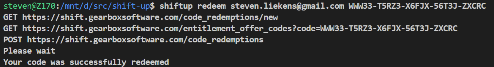

# SHiFT-up
Redeeming SHiFT codes in-game is annoying, especially on consoles where you have to use the on-screen keyboard instead of a physical keyboard.

This command-line tool lets you redeem codes from the convenience of your computer, without having to launch a game.

# Prerequisites
- Node 10+
- NPM or Yarn
- A Gearbox SHiFT account (https://shift.gearboxsoftware.com/)

# Instructions
1. install dependencies
    - `npm install`
2. (first time only) enter your Gearbox SHiFT e-mail and password
    - `npm start login <email> <password>`
    - your credentials are transmitted over a secure connection to Gearbox **only**
    - an authentication cookie will be stored inside `secrets/<email>.json`
       - this file contains your login session, do not share this file with anybody! 
    - I will NEVER try to steal your credentials
3. Enter the code that you would like to redeem
    - `npm start redeem <email> <code>`

If all went well, you should see the words "Your code was successfully redeemed".

Check the website to confirm that it worked.  
https://shift.gearboxsoftware.com/rewards

# Known issues
Message:
 > To continue to redeem SHiFT codes, please launch a SHiFT-enabled title first!

My best guess is that you reached some kind of hourly (daily?) limit. Come back later.

Message:
> Internal Server Error

Something went wrong and it's not your fault. But let's keep it honest, you probably entered a bad code.

Message:
> StatusCodeError: 412 - "{}"

You probably entered a bad code.

# Planned features
- interactive mode: prompt for credentials and codes
- silent mode: don't log anything to stdout
- error handling (failed logins)

# Disclaimer
I don't work for Gearbox Software.

© 2018 Gearbox Software, LLC. SHiFT is trademark of Gearbox Software, LLC.
