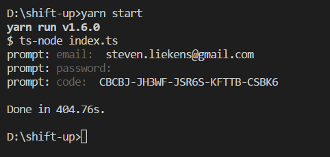

# SHiFT-up
Redeeming SHiFT codes in-game is annoying, especially on consoles where you have to use the on-screen keyboard instead of a physical keyboard.

This command-line tool lets you redeem codes from the convenience of your computer, without having to launch a game.

# Prerequisites
- Node 8+
- Yarn 
- A Gearbox SHiFT account (https://shift.gearboxsoftware.com/)

# Instructions
1. install dependencies
    - `yarn install`
2. start the app
    - `yarn start`
3. (first time only) enter your Gearbox SHiFT e-mail and password
    - your credentials are transmitted over a secure connection to Gearbox **only**
    - an authentication cookie will be stored inside `cookies.json`
       - this file contains your login session, do not share this file with anybody! 
    - I will NEVER try to steal your credentials
4. Enter the code that you would like to redeem

If all went well, you should see the words "Done in 30s" (or similar).

Check the website to confirm that it worked.  
https://shift.gearboxsoftware.com/rewards

# Known issues
Message:
 > To continue to redeem SHiFT codes, please launch a SHiFT-enabled title first!

My best guess is that you reached some kind of hourly (daily?) limit. Come back later.

# Planned
- make it a real CLI app
- split the login flow and code redemption flow into separate commands
- silent mode: pass code as an argument, don't show any prompts

# Disclaimer
I don't work for Gearbox Software.

© 2018 Gearbox Software, LLC. SHiFT is trademark of Gearbox Software, LLC.
